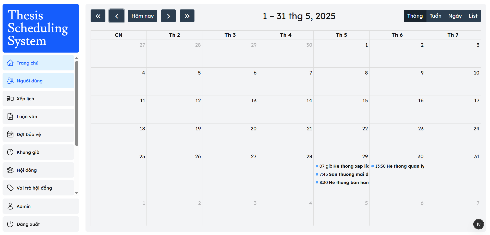
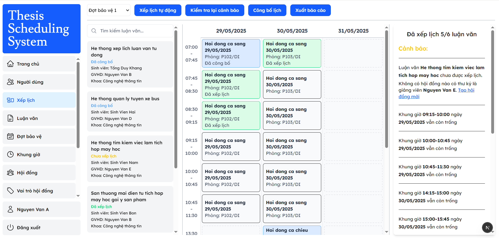
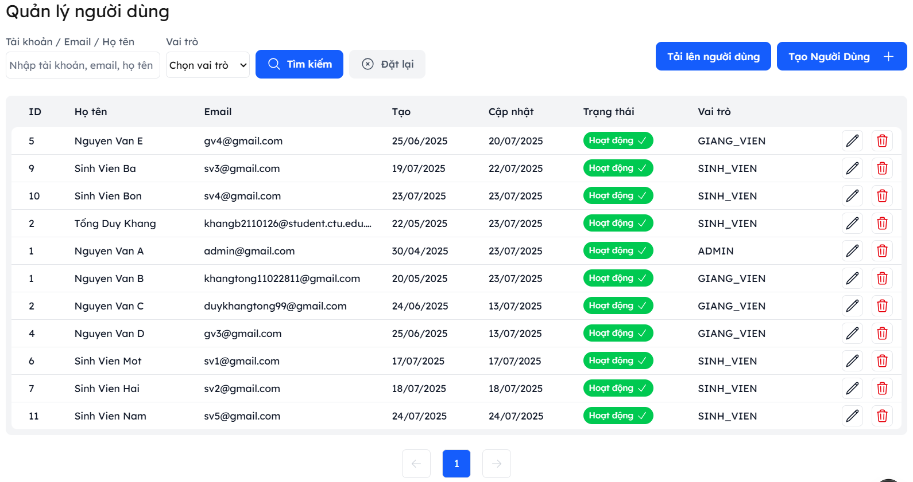
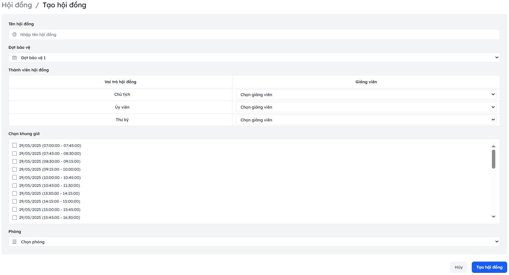
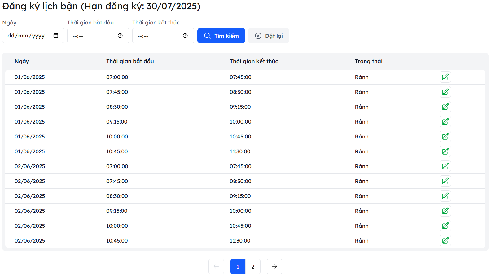

# Thesis Scheduling System - A Thesis Scheduling and Management System

A thesis scheduling system integrated with automatic scheduling and built with Next.js, TailwindCSS, Spring Boot, and PostgreSQL.

## ✨ Features

### User Management

- **Authentication**: Secure login with username/email & password
- **Authorization**: Role-based access control (Admin, Lecturer, Student)
- **Profile Customization**:
  - Update user information, change password
  - Password reset functionality
- **User Management**:
  - Search user
  - View user list
  - Add new user
  - Edit user information
  - Delete user

### Core Features

- **Thesis Management**:
  - Create, edit, and delete thesis
  - View thesis list
  - Search thesis by title, student, ...
- **Defense Committee Management**:
  - Create, edit, and delete defense committee
  - Create, edit and delete committee role
  - View defense committee list
  - Search defense committee by name, ...
- **Register unavailable time**:
  - Allow lecturers to register their own unavailable time
  - Register unavailable time for each defense committee member
  - View registered unavailable time
- **Thesis Scheduling**:
  - Schedule/Auto schedule thesis defense
  - View scheduled thesis
  - Edit scheduled thesis
  - Unschedule thesis
  - Publish scheduled thesis
  - Export scheduled thesis to Excel
- **Notify users by sending emails**

## 🛠 Tech Stack

**Frontend**:

- Next.js 15 (App Router)
- TailwindCSS + shadcn/UI

**Backend**:

- Spring Boot 3.2
- Spring Security (JWT Authentication)
- Spring Data JPA
- Spring Mail
- PostgreSQL

## 📸 Application Screens

**Log in**


**Dashboard**



**Thesis scheduling**



**User management**



**Create defense committee**



**Register unavailable time**



## 🚀 Getting Started

### Prerequisites

- Node.js 18+
- Java 17+
- PostgreSQL

### Installation

1. **Clone Repository**

```bash
git clone https://github.com/khangtong/thesis-scheduling-system.git
cd thesis-scheduling-system
```

2. **Backend Setup (IntelliJ IDEA)**

- Install dependencies
- Run the backend application
- Create a PostgreSQL database
- Update the database configuration in `application.properties`

3. **Frontend Setup**

```bash
cd frontend
npm install
npm run dev
```
